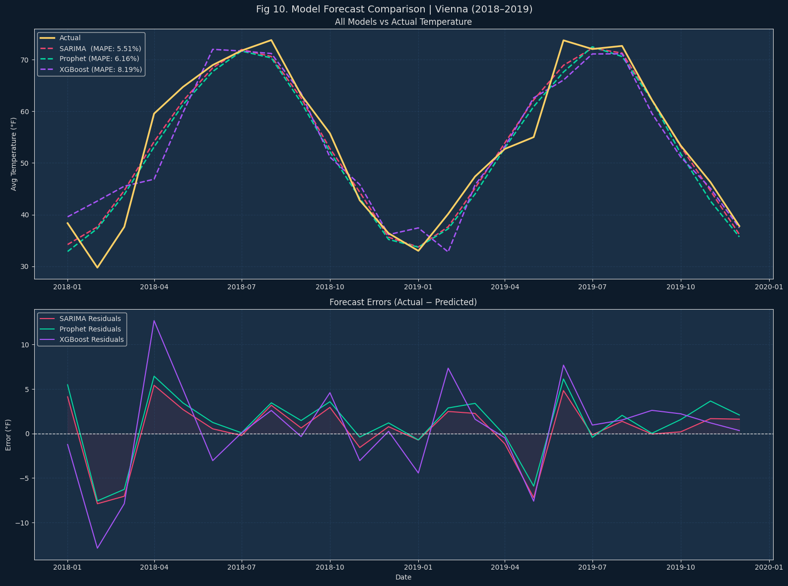
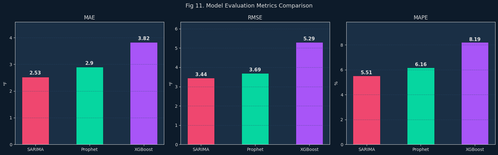
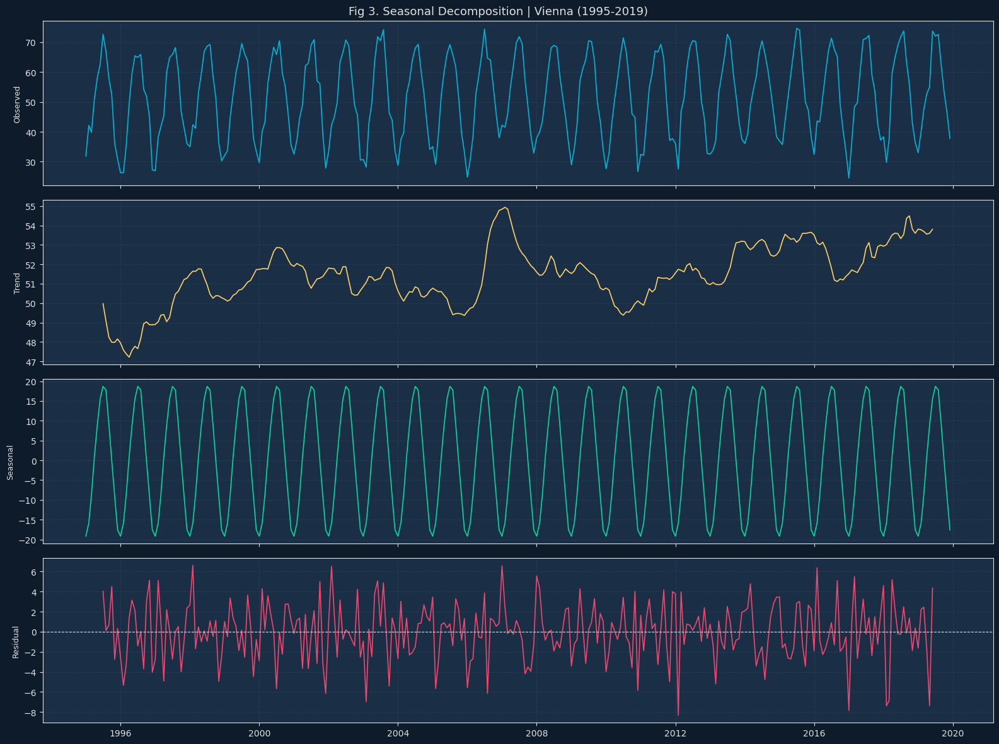

# Temperature Forecasting with SARIMA, Prophet & XGBoost
### Time Series Analysis | Vienna, Austria (1995–2019)

---

## Project Overview

This project applies classical and machine learning time series 
forecasting methods to predict monthly average temperatures in 
Vienna, Austria. Using 25 years of daily temperature data, we 
build and compare three models — SARIMA, Prophet, and XGBoost — 
evaluating their performance on a 24-month holdout test set 
(2018–2019).

The project covers the full data science pipeline:
- Exploratory Data Analysis (EDA)
- Stationarity testing (ADF, ACF, PACF)
- Seasonal decomposition
- Model building and forecasting
- Model evaluation and comparison

---

## Project Structure
```
├── data/
│   └── city_temperature.csv        # Raw dataset (Kaggle)
├── notebooks/
│   └── temperature_forecasting.ipynb  # Main project notebook
├── images/
│   └── *.png                       # Exported figures
├── README.md                       # Project documentation
└── requirements.txt                # Python dependencies
```

---

## 📊 Dataset

**Source:** [Daily Temperature of Major Cities — Kaggle](https://www.kaggle.com/datasets/sudalairajkumar/daily-temperature-of-major-cities)

| Property | Details |
|---|---|
| City | Vienna, Austria |
| Period | January 1995 – December 2019 |
| Frequency | Daily → resampled to Monthly |
| Target Variable | Average Temperature (°F) |
| Train Set | 1995–2017 (276 months) |
| Test Set | 2018–2019 (24 months) |

---

## Methodology

### 1. Exploratory Data Analysis
- Raw time series visualization with rolling mean and std
- Seasonal decomposition (additive model)
- Monthly and seasonal distribution analysis
- Stationarity testing via ADF test
- ACF and PACF analysis for model order identification

### 2. Models

#### SARIMA(3,1,0)×(1,1,2,12)
Classical statistical model. Orders identified automatically 
using `auto_arima` with AIC as the selection criterion. Applies 
both regular and seasonal differencing to handle the yearly cycle.

#### Prophet
Facebook's forecasting model. Handles trend and seasonality 
through curve fitting with Fourier series. Configured with 
`seasonality_mode='additive'` based on EDA findings.

#### XGBoost
Gradient boosting ML model. Forecasts using engineered time 
features including lag values (lag_1, lag_2, lag_12, lag_24), 
rolling means, and calendar features (month, quarter, year).

### 3. Evaluation Metrics
- **MAE** — Mean Absolute Error (°F)
- **RMSE** — Root Mean Squared Error (°F)  
- **MAPE** — Mean Absolute Percentage Error (%)

---

## 📈 Results

| Model | MAE | RMSE | MAPE | Rank |
|---|---|---|---|---|
| **SARIMA** | 2.53°F | 3.44°F | 5.51% | 1st |
| **Prophet** | 2.90°F | 3.69°F | 6.16% | 2nd |
| **XGBoost** | 3.82°F | 5.29°F | 8.19% | 3rd |

### Forecast Comparison


### Model Metrics


### Seasonal Decomposition


SARIMA achieves the best performance on this dataset, as expected 
for a highly regular seasonal series. All three models achieve 
MAPE below 10%, confirming reliable forecasting accuracy.

---

## Installation & Usage

### 1. Clone the repository
```bash
git clone https://github.com/yllkeberisha24/time-series-forecasting-project
cd time-series-forecasting-project
```

### 2. (Recommended) Create a virtual environment
Linux / macOS:
```bash
python3 -m venv .venv
source .venv/bin/activate
```
Windows (PowerShell):
```powershell
python -m venv .venv
.\.venv\Scripts\Activate.ps1
```

### 3. Install dependencies
```bash
pip install -r requirements.txt
```

### 4. Obtain the dataset
The notebook expects the file `data/city_temperature.csv`. This repository does not track large data files.

- Option A — Kaggle (recommended):
  1. Sign in to Kaggle and go to https://www.kaggle.com/datasets/sudalairajkumar/daily-temperature-of-major-cities
  2. Using the Kaggle CLI (after creating an API token), run:
  ```bash
  kaggle datasets download -d sudalairajkumar/daily-temperature-of-major-cities -p data --unzip
  ```

- Option B — Direct download via environment variable:
  If you have a direct CSV URL, set `CITY_TEMPERATURE_URL` and run:
  ```bash
  export CITY_TEMPERATURE_URL="https://example.com/path/to/city_temperature.csv"
  mkdir -p data
  curl -L "$CITY_TEMPERATURE_URL" -o data/city_temperature.csv
  ```
  On Windows PowerShell, use `curl` or `Invoke-WebRequest` accordingly.

Note: `data/city_temperature.csv` is listed in `.gitignore` and should NOT be committed to the repository.

### 5. Run the notebook
```bash
    notebooks/vienna_temperature_time_series_analysis.ipynb
```

---

## Requirements

See `requirements.txt` for full list. Core dependencies:

| Package | Purpose |
|---|---|
| pandas | Data manipulation |
| numpy | Numerical computing |
| matplotlib / seaborn | Visualization |
| statsmodels | SARIMA, ADF, decomposition |
| pmdarima | auto_arima |
| prophet | Prophet model |
| xgboost | XGBoost model |
| scikit-learn | Evaluation metrics |

---

## Key Findings

- Vienna's temperature exhibits **strong, stable yearly seasonality** 
  with summer peaks ~75°F and winter troughs ~30°F
- The **2003 European heatwave** is visible as an anomaly in both 
  the trend and residual components
- The ADF test detects **stationarity in the mean**, but ACF analysis 
  reveals seasonal non-stationarity requiring seasonal differencing
- **Additive decomposition** is appropriate as seasonal amplitude 
  remains constant regardless of trend level
- SARIMA outperforms ML-based XGBoost on this regular seasonal 
  series, highlighting that **classical models remain competitive** 
  for well-structured time series data

---

## Author

**Yllkë Berisha**  
Course: Time Series Forecasting 2025/2026

Institution: Central European University
Date: April 2026

---

## 📄 License

This project is for academic purposes only.